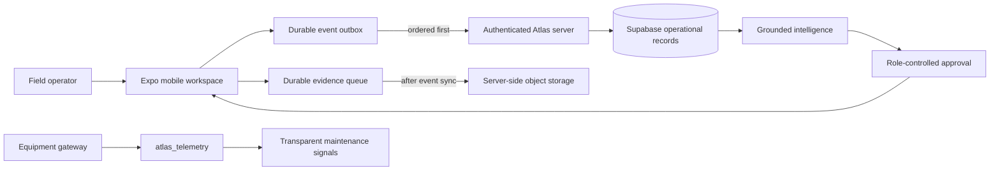

# Atlas Critical Architecture

## Operating loop

Atlas is organized around one traceable industrial operating loop: **observe → understand → decide → act → verify**. The mobile app remains useful offline, while live records, evidence, telemetry, intelligence, and approvals converge server-side when connectivity and authorization allow it.

## Critical layers

| Layer | Responsibility | Critical invariant |
|---|---|---|
| **Mobile workspace** | Command, work, assets, operations, inspection, scan, voice, commerce, and intelligence workflows. | No operational action is presented as complete until the app records its local state or receives a server result. |
| **Atlas sync provider** | One application-wide owner for the event outbox and evidence queue. | Field events synchronize before dependent photo or audio evidence; sync resumes on network recovery and app activation. |
| **Authenticated server** | Role checks, facility scoping, schema-facing procedures, evidence storage, intelligence grounding, and approval recording. | The mobile client never receives service-role or storage credentials. |
| **Supabase records** | Members, facilities, assets, work, controls, events, evidence metadata, telemetry, recommendations, and approvals. | Every server read and mutation is constrained to the authenticated member’s role and facility scope. |
| **Evidence storage** | Photo and voice-object persistence. | Files are retained locally until a successful server upload; only reviewed media types up to 16 MB are accepted. |
| **Telemetry gateway** | Equipment-originated readings from an approved integration. | Gateways write only documented metrics and timestamps; maintenance signals recommend human action rather than executing irreversible work. |
| **Grounded intelligence** | Evidence-based operating analysis. | Recommendations cite scoped Atlas records and require an authorized decision before execution. |

## Ordered offline synchronization

The sync coordinator solves the most important offline dependency: evidence must not become the only remote artifact of a field action. It loads both local queues, waits for network reachability, pushes field events first, and uploads attached evidence only when no event remains pending. If a field event cannot synchronize, evidence remains on-device with its retry state intact.

| State | Event outbox | Evidence queue | App behavior |
|---|---|---|---|
| Offline capture | Durable local record | Durable local file copy | Shows queued state; no network attempt. |
| Reconnected | Flushes field events | Waits | Preserves event-before-evidence order. |
| Event accepted | Empty or reduced | Upload begins | Server stores object and evidence metadata idempotently. |
| Upload failure | Already accepted | Retry count increases | File stays local; a later sync retries without duplicating work. |

## Security and governance boundaries

Atlas verifies active member roles before any operational mutation. Facility-scoped users cannot record events, upload evidence, or verify controls outside their scope. Required-evidence controls remain unverified until their evidence object is confirmed in `atlas_evidence`. Event timestamps are limited to five minutes in the future, payloads are capped at 64 KB, and evidence is restricted to reviewed image and audio formats.

The deployment boundary remains explicit: `atlas_schema.sql` is applied through an authorized Supabase deployment path; the mobile bundle receives only public runtime configuration. Server-side procedures retain the service role and storage integration. The Management API test remains conditional until deployment credentials are supplied.

## Production readiness sequence

1. Apply `supabase/atlas_schema.sql` using an authorized Supabase project-management path.
2. Create the first facility, role-scoped manager, and asset records using the initial access template.
3. Configure the equipment gateway to write approved rows into `atlas_telemetry` as documented in `telemetry-gateway.md`.
4. Use a physical device to capture one offline inspection photo and one offline voice report, reconnect, and verify ordered event and evidence sync.
5. Enable live operations for a small facility scope, observe queue and telemetry behavior, then expand roles and facilities deliberately.
